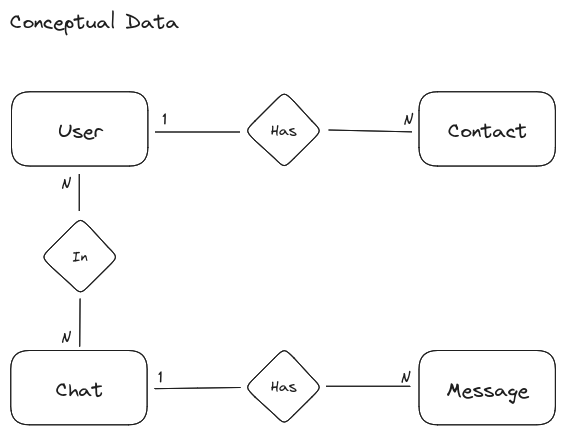

# Django Chat App Documentation

## User Stories
- As a new user, I want to be able to create a new account with my email and password so that I can start using the chat app.
- As a registered user, I want to be able to log in with my credentials so that I can access my chat account.
- As a user, I want to be able to edit my profile information, including my display name and profile picture, to personalize my chat experience.
- As a user, I want to be able to search for and add contacts by their username or email address so that I can start chatting with them.
- As a user, I want to be able to create new chat rooms or one-on-one conversations with my contacts to communicate with them.
- As a user, I want to be able to send text messages, emojis, and multimedia files (images, videos) to my contacts.
- As a user, I want to receive real-time notifications for new messages so that I am aware of incoming messages even when the app is not open.
- As a user, I want to be able to create and participate in group chats with multiple contacts for collaborative discussions.
- As a user, I want to be able to edit or delete messages I have sent in a chat to correct mistakes or remove content.
- As a user, I want to be able to view the chat history with a contact, including all the messages sent and received.
- As a user, I want to be able to set and update my online/offline status and view the status of my contacts.

## Use Cases
1. **Account Creation:**
   - User provides email and password.
   - System validates the provided information.
   - User account is created.
2. **Login:**
   - User provides email and password.
   - System verifies the credentials.
   - User is logged into the chat app.
3. **Profile Management:**
   - User edits display name or profile picture.
   - Changes are saved in the user's profile.
4. **Contact Management:**
   - User searches for contacts by username or email.
   - User adds contacts to their list.
5. **Chat Creation:**
   - User selects contacts to create a new chat.
   - System creates a new chat room.
6. **Messaging:**
   - User sends text, emojis in a chat.
   - Messages are delivered to the recipients.
7. **Notifications:**
   - System sends real-time notifications for new messages.
   - User receives notifications even when the app is in the background.
8. **Group Chats:**
   - User creates a group chat with multiple contacts.
   - User and contacts participate in the group chat.
9. **Message Editing and Deletion:**
   - User edits or deletes a sent message.
   - Changes are reflected in the chat history.
10. **Chat History:**
    - User views the chat history with a contact.
    - All past messages are displayed in chronological order.
11. **Online/Offline Status:**
    - User sets online/offline status.
    - User and contacts see each other's online/offline status.

## Business Logic, Functional and non Functional Requirements
- **Business Logic:**
  - The system must securely store user account information.
  - Chat rooms must be dynamically created and managed.
  - Messages must be securely transmitted and stored.
  - Notifications must be delivered in real-time.
- **Functional Requirements:**
  - User authentication and authorization.
  - Profile management functionalities.
  - Contact management functionalities.
  - Chat creation and participation functionalities.
  - Messaging functionalities with support for multimedia.
  - Real-time notification functionalities.
  - Group chat functionalities.
  - Message editing and deletion functionalities.
  - Chat history functionalities.
  - Online/offline status functionalities.
- **Non-Functional Requirements:**
  - **Security:**
    - User data must be encrypted during transmission.
    - Authentication mechanisms must be secure.
  - **Performance:**
    - Real-time features should have low latency.
    - The system should handle a large number of simultaneous users.
  - **Scalability:**
    - The system should be scalable to accommodate growing user numbers.
  - **Usability:**
    - The user interface should be intuitive and user-friendly.
    - The system should provide clear feedback on user actions.
  - **Reliability:**
    - The system should be available and reliable at all times.
    - Backup mechanisms should be in place to prevent data loss.

## System Architecture

### System

### Data

- **Conceptual Data**

- **Logical Data**

 
